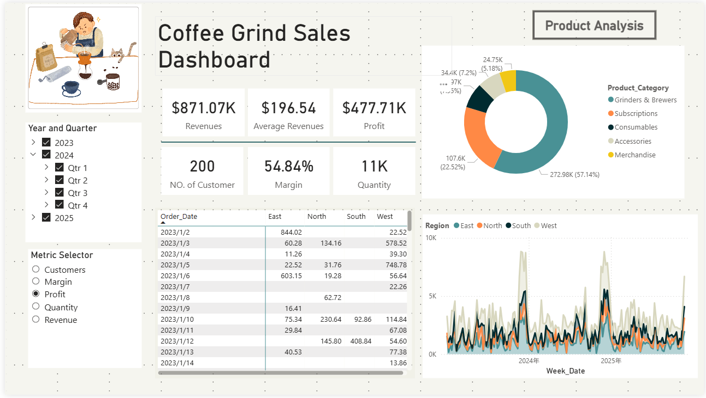

# Sales Performance & Pricing Analysis | SQL + Power BI

This project demonstrates a complete end-to-end data analysis workflow using **MySQL and Power BI**, focusing on product profitability and pricing decisions.

The project is based on an online tutorial, with custom improvements including:
- modified KPI calculations (especially customer logic)  
- improved dashboard layout and visual clarity  
- implementation using MySQL instead of SQL Server  

## Dashboard Preview

## Objective

To analyse sales performance and identify:

- low-performing products  
- unprofitable items  
- pricing improvement opportunities  

## Data Preparation (MySQL)
- Database setup (MySQL schema and data import)
- Data integration (combining 2023–2025 orders and the other datasets)
- Data cleaning (handling missing values and format inconsistencies)
- Data transformation (feature creation such as Week_Date, Profit)

## Dashboard (Power BI)
An interactive Power BI dashboard was developed to support decision-making.

### Features
- Dynamic KPI selector
- Visual analysis including:
  - product category performance  
  - weekly trends  
  - regional comparison  

## Key Insight

The analysis revealed that increasing COGS has reduced profitability, with several products becoming structurally unprofitable, highlighting the need for pricing adjustments or discontinuation.

## Tech Stack
- MySQL
- Power BI
- DAX

## Acknowledgements

This project follows an online tutorial as a learning reference, with independent implementation and modifications.

- Tutorial reference:  
  https://www.youtube.com/watch?v=Yhx_2HT-TU0&t=1187s

- Image inspiration:  
  https://cdn.dribbble.com/userupload/27960729/file/original-25f837cc7f41130f9571a60230667f9d.gif

Key modifications include:
- Implementation using MySQL instead of SQL Server  
- Adjusted KPI calculations (e.g. customer metric logic)  
- Improved dashboard layout and design  

